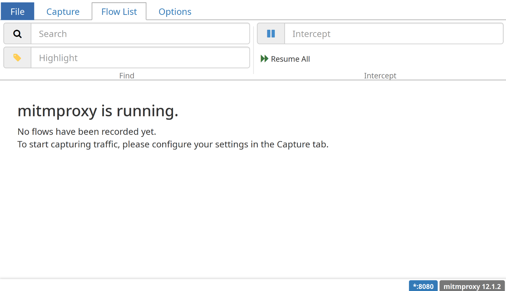
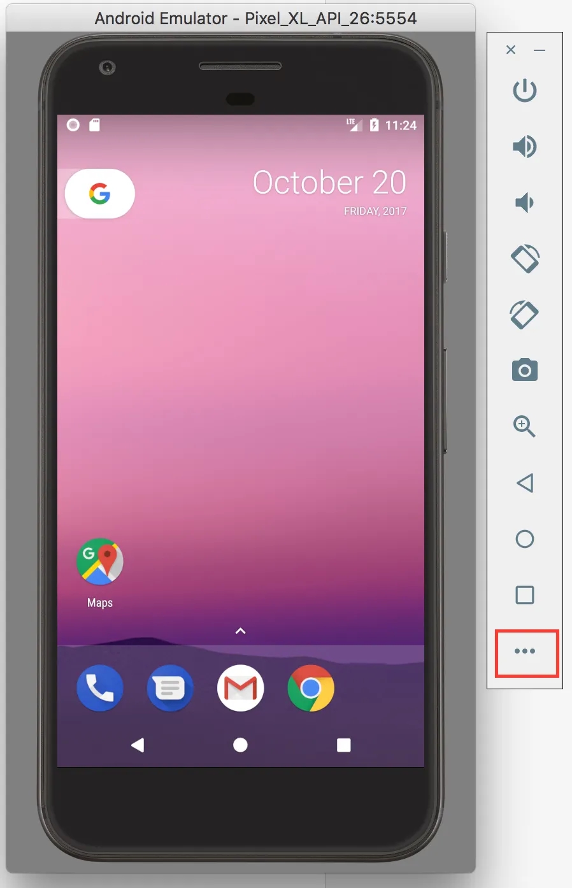
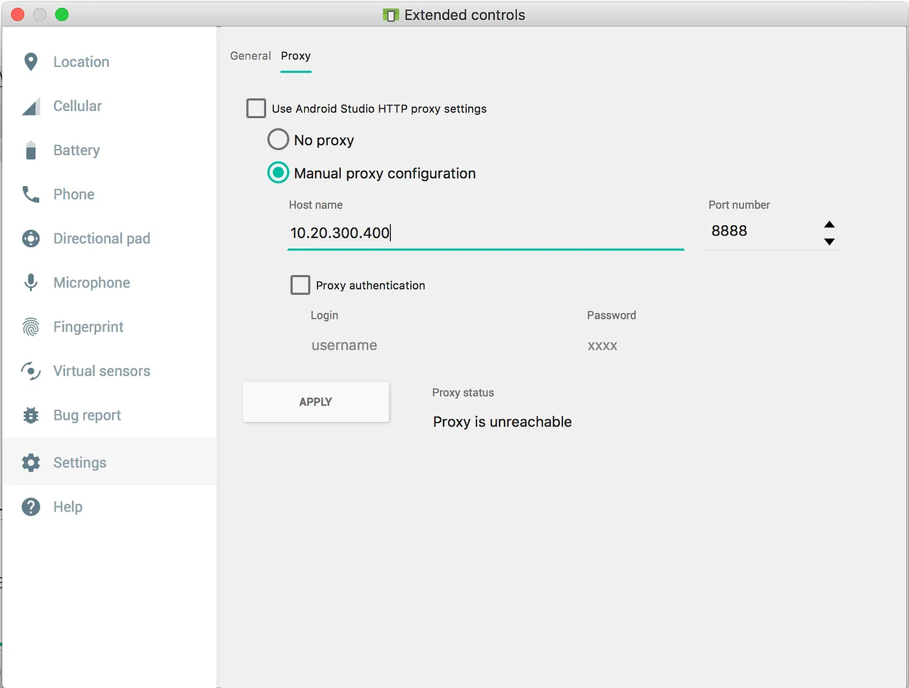
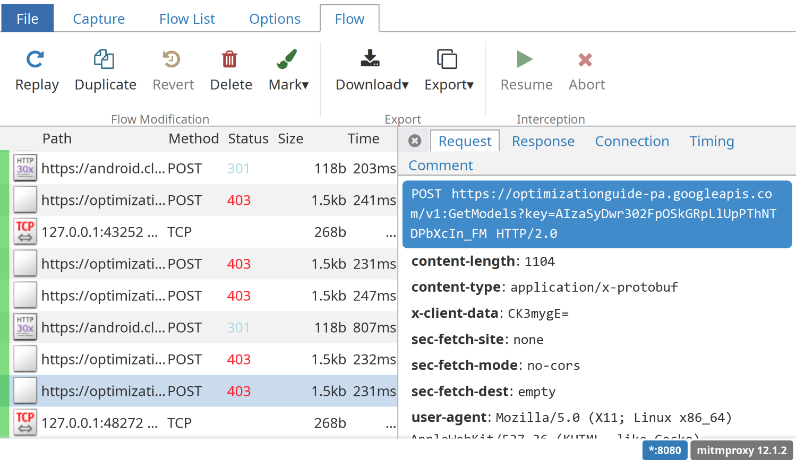
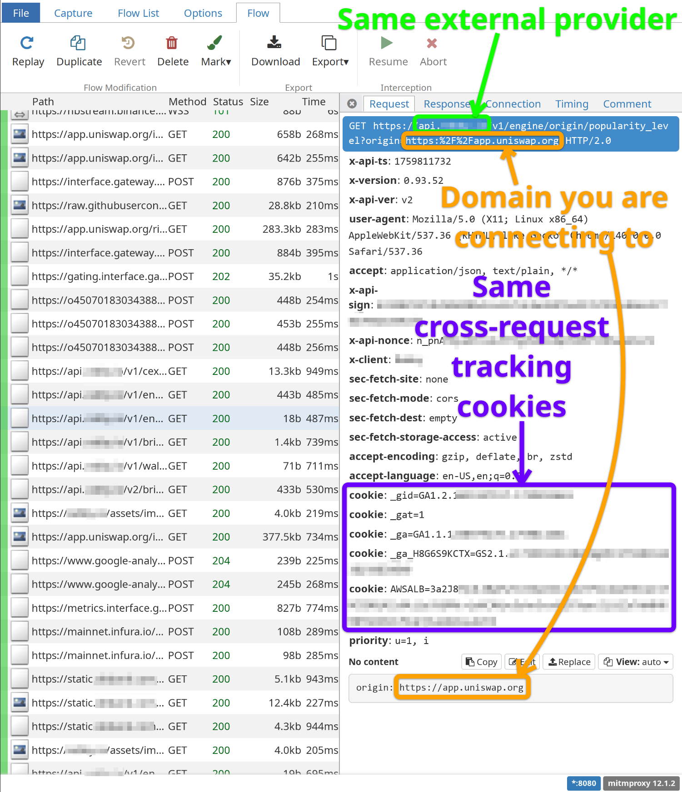

# `mitmproxy` guide

This guide describes how to set up [`mitmproxy`](https://mitmproxy.org) to inspect the network traffic that a wallet generates.

## Why?

This analysis is crucial in order to determine certain wallet attributes, such as:

- **Private key handling**: Does any external provider learn of your seed phrase or private key?
- **Wallet address privacy**: Is your Ethereum address linkable to other information about yourself?
- **Multi-address privacy**: Can your multiple wallet addresses be correlated with one another?
- **Account portability**: Does the wallet rely on any external service to export your credentials, i.e. is this external provider in a position to deny exporting your account data?
- **Orderflow transparency**: Which external services get to see your transaction data before it is included onchain, and is therefore in a place where they can frontrun you?
- **Browsing history leakage**: Does the wallet leak your visited sites to any external provider? (Yes, some wallets have done this.)

Therefore, it is important that the data gathered using this technique is comprehensive and accurate.

## Step-by-step

### Step 1: Install `mitmproxy`

You will need a desktop computer for this. Installation instructions differ based on your operating system. Follow the [`mitmproxy` installation guide](https://docs.mitmproxy.org/stable/overview/installation/) for your operating system.

### Step 2: Start `mitmweb`

Once installed, run `mitmweb` in your terminal. This will start `mitmproxy` and also launch a web UI (also accessible at `http://127.0.0.1:8081`) that looks like this:



You should **not** use the web browser this web UI is running in as your test browser. You will use a separate, purpose-built browser for this later. For now, keep this web interface open.

### Step 3: Create a dedicated browser or device for wallet testing

In order to eliminate noise from the network capture you are about to do, it is imperative to use a dedicated browser or mobile device for wallet testing.

- **For browser extension wallet testing**: The easiest way is to use a different profile. Different browsers have different ways to do this. For Chromium, run `chromium --user-data-dir=/tmp/walletbeat-test-browser` in your terminal. This will launch a dedicated `chromium` browser that lives completely separately from whatever other browser you may otherwise use. All browser-related files will be stored in `/tmp/walletbeat-test-browser`, all settings will be unique to this browser, and all extensions will apply to this browser only.

* **For mobile app wallet testing**: The easiest way is to use an emulated Android device using [Android Studio](https://developer.android.com/studio). Create a new emulated device for the purpose of wallet testing.

### Step 4: Set up your browser or device for `mitmproxy`

As the name implies, `mitmproxy` is a proxy. This means it intercepts requests and forwards them onto their initially-intended destination.
Putting `mitmproxy` in a place where it _can_ intercept requests from a wallet is a 2-step process:

#### Step 4.a: Set up proxy settings

You will need to configure your browser or mobile device to use `mitmproxy` as a proxy. This is browser-dependent (or device-dependent); what's not device dependent is the `mitmproxy` proxy settings: the IP is `127.0.0.1` and the port number is `8080`.

- **For browser extension wallet testing**: Set your browser's proxy settings. This is usually located in the settings. If using a dedicated `chromium` profile from earlier, you can also specify it on the command line: `chromium --user-data-dir=/tmp/walletbeat-test-browser --proxy-server=http://127.0.0.1:8080`
- **For mobile app wallet testing**: Go to the the Android Studio's settings for the emulated device (**not** the "Settings" app inside the emulated device itself), and you can set device-wide proxy configuration here:




Unlike the above screenshot, you will want `127.0.0.1` as "Host name", and `8080` as port.

#### Step 4.b: Install the `mitmproxy` certificate

Because `mitmproxy` needs to intercept authenticated HTTPS connections, it needs to use a certificate that your browser or mobile device will initially be very suspicious of. HTTPS is _designed_ to prevent request interception, which is why you will see lots of scary warnings in the process of adding a trusted certificate. Nonetheless, this is required for `mitmproxy` to be able to intercept authenticated requests and show their contents.

To do this, navigate to `http://mitm.it`. If you get a page that says "traffic is not passing through mitmproxy", then go back through this guide and figure out what went wrong. Otherwise, you should get a page that looks like this:


Follow the appropriate instructions for your operating system or platform. You may need to restart your browser or device after certificate installation.

### Step 5: Verify setup

On your test browser or mobile device, go to `http://mitm.it`. If you get a page that says "traffic is not passing through mitmproxy", then go back through this guide and figure out what went wrong.

Then, navigate to some other page, such as [Ethereum.org](https://ethereum.org). Once the page has loaded, go to the `mitmweb` web UI, and you should see something like this:


If you see this, congrats, you are ready to start testing!

### Step 6: Install the wallet

Install the wallet browser extension or app as you normally would. **Do not go through wallet onboarding just yet**.

### Step 7: Restart from a clean slate

Modern web browsers and mobile operating systems produce a lot of background requests even when not in use. By this point in the guide, you likely have a lot of such cruft in `mitmweb`.
To reduce noise from these, we need to restart from a cleaner slate.

- **Step 7.a**: Shut down the browser/mobile device.
- **Step 7.b**: In the `mitmweb` web UI, go to `File → Clear All` to get rid of the cruft.
- **Step 7.c**: Restart the browser or mobile device.

### Step 8: Go through wallet onboarding

Go through the wallet onboarding process. As soon as you are done, **close the browser or mobile device** to stop producing unrelated traffic.

### Step 9: Take note of all requests made

#### Step 9.a: Identify relevant requests.

Go through all entries in the `mitmweb` web UI. **This will likely contain entries not created by the wallet software itself**, but rather by the web browser or by the operating system.
These are not relevant for Walletbeat. What we care about are **requests that carry any wallet-related information**, i.e.:

- Anything that contains an Ethereum wallet address.
- Ethereum RPC traffic data: balance lookups, transaction submissions, etc.
- Wallet application analytics: clicks, page opens, wallet crash reporting services, etc.
- Ethereum-wallet-specific details: for example, ERC-20 token icons, which can be used to determine the specific _mix of assets_ that a wallet user has.
- A transaction intent, e.g. token swap quote.
- Any request that includes data collected by the wallet from the user: wallet username, personal information, CEX account details, etc.
- Unique identifiers carried across wallet-related requests, which can be used by external wallet services to track user actions across multiple UX flows.

To determine whether any request qualifies, simply click on the request in the `mitmweb` web UI and inspect the contents of the `Request` tab. Look especially at the URL (first line), the `Cookie` header, and the payload (bottom of `Request` tab).

##### Example of an **irrelevant** request:

This request is very likely a "background" request initiated by `chromium` to spy on its users: it is a Google-owned domain, does not seem to carry any wallet-related information, and is initiated at regular intervals in the network capture.



You can safely ignore such requests, as they are not initiated by the wallet you are testing.

##### Example of **relevant** requests:

The following requests were taken while connecting a wallet to the `app.uniswap.org` dapp frontend using a wallet that shall remain unnamed.

In this request, the wallet looks up the total balance of the user:


You can see that the Ethereum wallet address (encoded as `WalletInfo.ACCOUNT_ADDRESS` below) is sent to an external provider, so this is definitely relevant. This is also done without any anonymizing proxy, so the external provider learns both the user's IP address (encoded as `PersonalInfo.IP_ADDRESS` below), as well as their Ethereum address. Moreover, they are sent a persistent set of tracking cookies which shows up in other requests made to the same provider, such as this other request:



This second request was made to the _same_ external provider, with the _same_ tracking cookies, sending the domain name of the dapp that the user is connecting to (encoded as `WalletInfo.WALLET_CONNECTED_DOMAINS` below).

In summary, through these two requests alone, this external provider is able to learn:

- The user's IP address
- The user's Ethereum wallet address
- The domain of the dapp the user is connecting to

... and has a set of tracking cookies present to be able to track further actions of the user and link them to this existing data.

#### Step 9.b: Populating wallet feature data

You can now populate the wallet's `privacy.dataCollection` entries. In the above example (capture taken during the dapp connection flow of the wallet), you would add:

```typescript
export const someWallet: SoftwareWallet = {
	features: {
		privacy: {
			dataCollection: {
				// We tested the browser version of the wallet:
				[Variant.BROWSER]: {
					// The UX flow that was being tested in the screenshots above was to connect to a dapp:
					[UserFlow.DAPP_CONNECTION]: {
						collected: [
							{
								// Use an existing entity or create a new one, depending on the external provider:
								byEntity: someExternalProvider,

								dataCollection: {
									// IP address implicitly collected because the wallet did not attempt to anonymize the connection:
									[PersonalInfo.IP_ADDRESS]: CollectionPolicy.ALWAYS,

									// The Ethereum address was sent to this external provider, with no way to opt out:
									[WalletInfo.ACCOUNT_ADDRESS]: CollectionPolicy.ALWAYS,

									// The domain name of the dapp was sent to this external provider, with no way to opt out:
									[WalletInfo.WALLET_CONNECTED_DOMAINS]: CollectionPolicy.ALWAYS,

									// [... Add other PersonalInfo or WalletInfo from requests to this same external provider within the same UX flow...]

									// The wallet did not attempt to anonymize the connection, nor to connect to a TEE.
									endpoint: RegularEndpoint,

									// The wallet (which had 2 configured addresses) only sent the current active Ethereum address:
									multiAddress: {
										type: MultiAddressPolicy.ACTIVE_ADDRESS_ONLY,
									},
								},
								purposes: [
									// The wallet looked up information about the user's balance, which is onchain data:
									DataCollectionPurpose.CHAIN_DATA_LOOKUP,

									// The purpose of the second request (`/popularity_level`) was probably to look up
									// whether the dapp was a known scam site:
									DataCollectionPurpose.SCAM_DETECTION,
								],
							},
							// [... Add data from requests to other external providers in the same UX flow here...]
						],
					},
					// [... repeat for other UX flows...]
				},
				// [... repeat for other wallet versions (mobile/desktop)...]
			},
		},
	},
}
```

**Optional**: For source-available wallets, you may also want to dig through the code to find what part of the code initiates this request, and add this as a `ref`.

```typescript
					[UserFlow.DAPP_CONNECTION]: {
						collected: [
							{
								// ... As above...
								purposes: [
									// ... As above...
								],
								ref: [
									{
										explanation:
											'The wallet checks whether the domain you are connecting your wallet to is on a scam list. It sends the domain along with Ethereum address in non-proxied HTTP requests for API methods `getOriginIsScam`, `getOriginPopularityLevel`, `getRecommendChains`, and others.',
										label: 'Wallet code on github.com',
										url: '', // Link to repo source file calling these functions.
									},
								],
							},
						],
					},
					// [...]
```

As you can imagine, this is very tedious to do, so consider using an LLM coding assistant to help you dig through the wallet's codebase to find these references, and consider doing this only for requests that you find especially surprising in terms of the user data they send.

### Step 10 onwards: Repeat for other UX flows.

Repeat steps 7 to 9 for other wallet UX flows: opening up the wallet, adding a new address, making an ERC-20 swap, connecting to a dapp, using the built-in swap feature if there is one, etc.

**NOTE**: Once you have added at least 2 addresses to the wallet, pay special attention to how the wallet handles these multiple addresses. This is specified in the `multiAddress` field of the `privacy.dataCollection` entries, and is used to determine whether wallets allow external providers to correlate multiple user addresses with one another.

Yes, this is tiresome work. It is also generally quite eye-opening. Godspeed! 🫡
