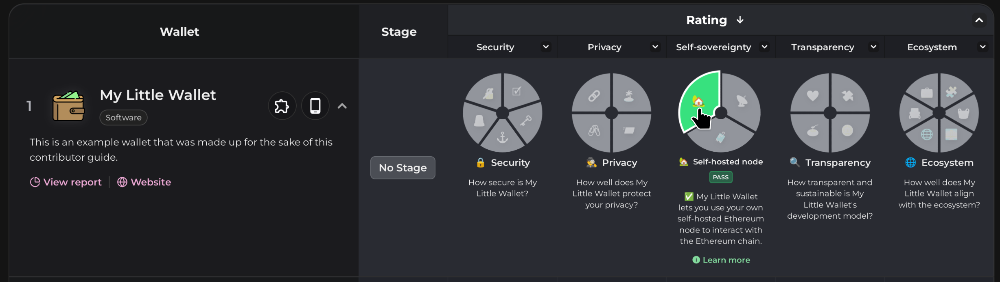
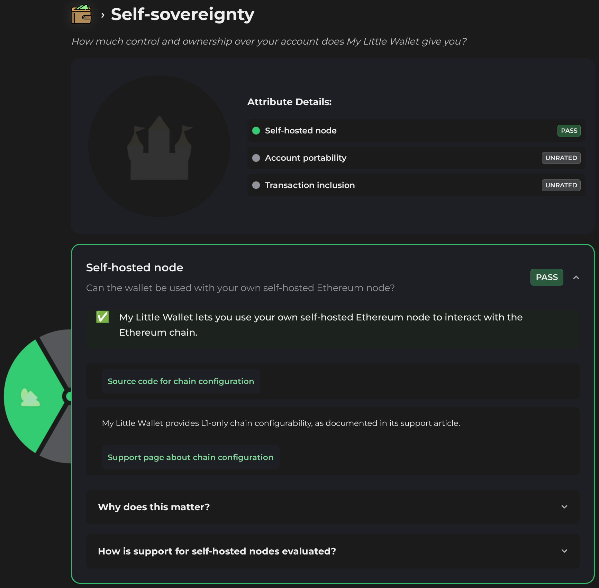
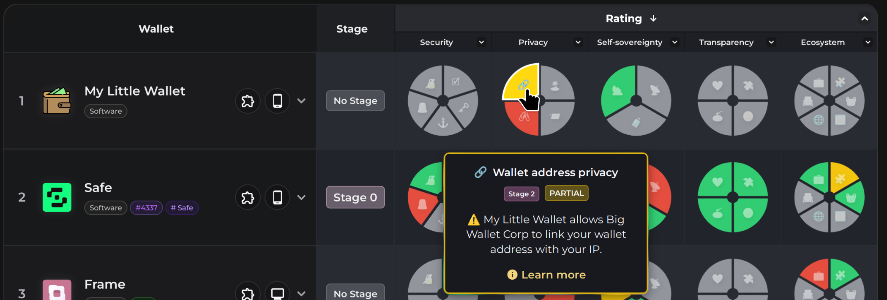

# Walletbeat guide: Wallet data entry

_This guide aims to help you contribute wallet data to Walletbeat. If you'd like to contribute to some other aspect of Walletbeat, see `CONTRIBUTING.md`._

## Development setup & workflow

Before you can contribute wallet data to Walletbeat, you need to make a copy of the site and its data and be able to run it on your computer so you can make changes. Please read the [`/resources/docs/contribute/CONTRIBUTING.md`](/resources/docs/contribute/CONTRIBUTING.md) guide if you need help with this. The rest of this guide **assumes you have already set up a Walletbeat development environment**.

## Wallet data changes

In Walletbeat, data about wallets is called **wallet feature data** (or equivalently: **wallet features**).
These are defined in such a way that they are all **objective**, **observable** information about a wallet's behavior or code.
Therefore, your core task when contributing wallet data is to **test a wallet** and **dive into its code** to fill in the wallet feature data for the wallet you are testing.

### Walkthrough assumptions

In this walkthrough, we will assume the following:

- You are rating a software wallet that Walletbeat does not have existing data on, named My Little Wallet and developed by Big Wallet Corporation LLC.
- My Little Wallet has a browser extension version and a mobile version, but not a desktop version.
- Your online nickname is Chain Monkey and this is your first time contributing to Walletbeat.
- You work for Big Wallet Corporation LLC.

### **Step 0**: Become familiar with the wallet data directory structure

Wallet data is located in the top-level `/data` directory. All files are written in TypeScript, which helps to ensure their validity and conformance. The `/data` directory has the following layout. We will go over each of these in detail in this guide.

```
/data
├── contributors          ← You will need to add a file here
│   ├── 0xh3rman.ts         if this is your first time contributing!
│   ├── example.ts        ← Use this as an example.
│   ├── gabrielkerekes.ts
│   ├── jiojosbg.ts
│   └── [...]
├── eips                  ← You do not need to touch this.
├── entities              ← Data about entities related to wallets
│   ├── ackee.ts            (wallet development companies, security auditors,
│   ├── ambire.ts           RPC providers, transaction simulation services,
│   ├── biconomy.ts         bundlers, swap quote services,
│   ├── binance.ts          hardware wallet manufacturers, etc.) all goes here.
│   ├── cantina.ts
│   ├── certik.ts
│   └── [...]
├── software-wallets      ← Data about software wallets goes here.
│   ├── ambire.ts           You will most likely add or edit a file in this
│   ├── elytro.ts           directory!
│   ├── rabby.ts
│   ├── [...]
│   ├── metamask.ts
│   ├── unrated.tmpl.ts   ← If adding a new software wallet, copy this file as template.
│   └── [...]
├── software-wallets.ts   ← The list of all known software wallets goes here.
├── hardware-wallets      ← Data about hardware wallets goes here.
│   ├── bitbox.ts           Same idea as software wallets.
│   ├── cypherock.ts
│   ├── firefly.ts
│   ├── gridplus.ts
│   ├── unrated.tmpl.ts   ← If adding a new hardware wallet, copy this file as template.
│   └── [...]
├── hardware-wallets.ts   ← The list of all known hardware wallets goes here.
├── embedded-wallets      ← Data about embedded wallets goes here.
├── embedded-wallets.ts   ← The list of all known embedded wallets goes here.
├── wallet-contracts      ← Data about smart wallets' smart contracts goes here.
│   ├── ambire-account.ts
│   ├── metamask-7702-delegator.ts
│   └── [...]
└── wallets.ts            ← You do not need to touch this.
```

_There is also a directory of wallet icons at `/public/images/wallets`._

### **Step 1**: Add a new wallet's basic information to Walletbeat

#### **Step 1.a**: Add an entry for the wallet development entity behind My Little Wallet

- Create a copy of `/data/entities/example.ts` at `/data/entities/big-wallet-corp.ts`, then remove all constants from this file other than `exampleWalletDevelopmentCompany`. Rename it to `bigWalletCorp` and fill in the details.
- Find an SVG icon of Big Wallet Corp LLC, and crop all the transparent edges out of the SVG. Save it as `/public/images/entities/bigWalletCorp.svg` (the filename matches the `id` field).
  - _(If you cannot find an SVG version of the icon, find a PNG version instead, crop it similarly, save it as `/public/images/wallet/bigWalletCorp.png`, and set `icon.extension` to `'png'` in the wallet data file. If you do this, you need to set the `icon.width` and `icon.height` fields as well.)_

You should now have something like this at `/data/entities/big-wallet-corp.ts`:

```typescript
import type { CorporateEntity, WalletDeveloper } from '@/schema/entity'

export const bigWalletCorp: CorporateEntity & WalletDeveloper = {
	id: 'bigWalletCorp',
	name: 'Big Wallet Corp',
	legalName: { name: 'Big Wallet Corp LLC', soundsDifferent: false },
	type: {
		chainDataProvider: false, // ← Change to `true` if Big Wallet Corp LLC also provides chain data RPC services. You will also need to add `& ChainDataProvider` to the bigWalletCorp type.
		corporate: true,
		dataBroker: false,
		exchange: false,
		offchainDataProvider: false,
		securityAuditor: false,
		transactionBroadcastProvider: false, // ← Change to `true` if Big Wallet Corp LLC also provides transaction broadcast RPC services. You will also need to add `& TransactionBroadcastProvider` to the bigWalletCorp type.
		walletDeveloper: true,
	},
	crunchbase: 'https://www.crunchbase.com/organization/bigwalletcorp',
	farcaster: { type: 'NO_FARCASTER_PROFILE' },
	icon: { extension: 'svg' },
	jurisdiction: 'Atlantis',
	linkedin: 'https://www.linkedin.com/company/bigwalletcorp/',
	privacyPolicy: 'https://bigwalletcorp.com/privacypolicy',
	repoUrl: 'https://github.com/bigwalletcorp', // NOT the wallet repository!
	twitter: 'https://x.com/bigwalletcorp',
	url: 'https://bigwalletcorp.com/',
}
```

#### **Step 1.b**: Add yourself as a contributor and enter your affiliation details

Create a copy of `/data/contributors/example.ts` at `/data/contributors/chain-monkey.ts`. Fill in the details.

As an employee of Big Wallet Corp LLC, you have any affiliation to a wallet development company. **This needs to be disclosed** in the `affiliation` field.

You should now have something like this at `/data/contributors/chain-monkey.ts`:

```typescript
import type { Contributor } from '@/schema/wallet'
import { bigWalletCorp } from '@/data/entities/big-wallet-corp'

export const chainMonkey: Contributor = {
	name: 'Chain Monkey',
	affiliation: [
		{
			developer: bigWalletCorp,
			hasEquity: true,
			role: 'EMPLOYEE',
		},
	],
}
```

#### **Step 1.c**: Add a skeleton wallet entry for My Little Wallet

- Create a copy of `/data/software-wallets/unrated.tmpl.ts` at `/data/software-wallets/my-little-wallet.ts`.
- Rename the top-level object from `unratedTemplate` to `myLittleWallet`.
- Change all `metadata.*` fields such as `id` (set to `'myLittleWallet'`), `displayName`, `blurb`, `lastUpdated` (set to today's date in `YYYY-MM-DD` format), `urls`, etc.
- Find an SVG icon of the wallet and crop all the transparent edges out of the SVG. Save it as `/public/images/wallet/myLittleWallet.svg` (the filename matches the `metadata.id` field).
  - _(If you cannot find an SVG version of the icon, find a PNG version instead, crop it similarly, save it as `/public/images/wallet/myLittleWallet.png`, and set `metadata.iconExtension` to `'png'` in the wallet data file.)_
- Set yourself as the sole contributor in `metadata.contributors`.
- Update the `variants` field to the set of versions that the wallet has. In this case, since My Little Wallet has a browser extension version and a mobile version, you would set `[Variant.MOBILE]` and `[Variant.BROWSER]` to `true`, and remove the `[Variant.DESKTOP]` field.

At the end of this process, you should have something that looks like this at `/data/software-wallets/my-little-wallet.ts`:

```typescript
// [... imports, including:]
import { chainMonkey } from '@/data/contributors/chain-monkey'

export const myLittleWallet: SoftwareWallet = {
	metadata: {
		id: 'myLittleWallet',
		displayName: 'My Little Wallet',
		tableName: 'My Little Wallet',
		blurb: paragraph(`
			This is an example wallet that was made up for the sake of
			this contributor guide.
		`),
		contributors: [chainMonkey],
		iconExtension: 'svg',
		lastUpdated: '2077-01-01',
		urls: {
			docs: ['https://mylittlewallet.com/docs'],
			extensions: ['https://mylittlewallet.com/extensions'],
			repositories: ['https://mylittlewallet.com/repo'],
			socials: {
				discord: 'https://discord.com/mylittlewallet',
				farcaster: 'https://farcaster.xyz/mylittlewallet',
				linkedin: 'https://linkedin.com/mylittlewallet',
				telegram: 'https://telegram.org/mylittlewallet',
				x: 'https://x.com/mylittlewallet',
			},
			websites: ['https://mylittlewallet.com'],
		},
	},
	features: {
		/* Do not touch this part yet; this comes in later steps. */
	},
	variants: {
		[Variant.MOBILE]: true,
		[Variant.BROWSER]: true,
		// Removed the "Variant.DESKTOP" line, because My Little Wallet has no desktop version.
	},
}
```

#### **Step 1.d**: Add the wallet to the list of known software wallets

For the wallet to be shown on the site, it needs to be listed in `/data/software-wallets.ts`. Import your wallet and update the `softwareWallets` object as follows:

```diff
 import { type RatedWallet, rateWallet } from '@/schema/wallet'

 import { ambire } from './software-wallets/ambire'
 import { elytro } from './software-wallets/elytro'
 // [... other wallets...]
+import { myLittleWallet } from './software-wallets/my-little-wallet'  // ← Add!

 /** Set of all known software wallets. */
 export const softwareWallets = {
 	ambire,
 	elytro,
 	// [... other wallets...]
+	myLittleWallet, // ← Add!
 }
```

### **Step 2**: Get the website up and running with the new wallet displayed

You have now added the wallet to Walletbeat's database. You can now run:

```bash
# Apply consistent formatting:
$ pnpm fix

# Verify that you did everything right:
$ pnpm check:all
# If it complains, fix it until it passes.

# Finally, run the site locally:
$ pnpm dev
# [...]
 astro  v5.15.2 ready in 1655 ms

┃ Local    http://localhost:4321/
┃ Network  use --host to expose
```

You can now browse the site at `http://localhost:4321/`. You should now see the wallet you added displayed in the comparison table. Of course, everything will be marked "unrated" at first (shown in gray).


You are now ready to iterate on populating the wallet data.

### **Step 3**: Populate wallet data

From the template that you copied earlier, you may have noticed that every field inside the `features` object is set to `null`. `null` values in `features` field always mean "unknown". Initially, everything about the wallet is unknown, so everything is set to `null`. Your goal as a wallet data contributor is to **get rid of as many `null`s as you feel confident you can populate**.

The general workflow to populate a `null` field with some real data is as follows:

- Look up what the field represents. The best source of information for this is usually the documentation on the type definition for that field.
- Test the wallet yourself or inspect its code to determine the value that the field should have.
- Write that value in the wallet data file, usually accompanied by a reference (`ref`, more on this later).
- Refresh the wallet rating page and observe whether this new data has turned any of the wallet attributes into states other than "unrated".
- Move on to the next feature field and repeat until there are none left.

Some fields are more complicated to populate than others. For this guide, we will walk through populating three fields with various degrees of complexity.

#### Example field A (easy): Multi-address support (`features.multiAddress`)

_This example walks through the use of the `VariantFeature` and `Support` types, which are used by nearly every feature field._

This field relates to whether or not the wallet lets you use multiple addresses. It is a simple yes/no question.

In your code editor, you should be able to click (perhaps `Ctrl+Click` or one of the right-click options, depending on your editor) on the `multiAddress` field inside the wallet data file to jump to the type definition of this `multiAddress` field. Use this technique to figure out how a type is defined:


This brings you to:

```typescript
export interface WalletBaseFeatures {
	// [...]

	/** Does the wallet support more than one Ethereum address? */
	multiAddress: VariantFeature<Support>

	// [...]
}
```

`VariantFeature<T>` is a wrapper type you will see nearly everywhere when editing wallet data. It allows you to specify a value one of two ways:

- Either using a value directly directly:

```typescript
export const myLittleWallet: SoftwareWallet = {
	// [...]
	features: {
		multiAddress: /* Some value here */,
	},
}
```

- Either using one value per wallet variant, i.e. different values for each variant the wallet has. In this case, this would be a different value for the browser version and the mobile version.

```typescript
export const myLittleWallet: SoftwareWallet = {
	// [...]
	features: {
		multiAddress: {
			[Variant.BROWSER]: /* Some value for the browser version here */,
			[Variant.MOBILE]: /* Some value for the mobile version here */,
		},
	},
}
```

For this example, let us assume that:

- The browser version of My Little Wallet **does** support multiple addresses.
- The mobile version of My Little Wallet **does not** support multiple addresses.

You would then use:

```typescript
import { featureSupported, notSupported } from '@/schema/features/support' // Needed imports

export const myLittleWallet: SoftwareWallet = {
	// [...]
	features: {
		multiAddress: {
			[Variant.BROWSER]: featureSupported,
			[Variant.MOBILE]: notSupported,
		},
	},
}
```

The `featureSupported` and `notSupported` constants describe whether a feature is supported or not. In this case, multi-address is supported on the browser version but not on mobile.

If you are confused about how to populate an attribute, you can also always look at another wallet that has the field defined in order to see how that wallet has it. In this case, here is the same field for Ambire (`/data/software-wallets/ambire.ts`):

```typescript
export const ambire: SoftwareWallet = {
	// [...]
	features: {
		// [...]
		multiAddress: featureSupported,
	},
	variants: {
		[Variant.BROWSER]: true,
	},
}
```

This means that Ambire only has a `BROWSER` version, and that this version supports using multiple addresses.

Once you have populated `features.multiAddress` for My Little Wallet, you may notice that **nothing may have changed** on the wallet rating page. Why is this? Because multi-address support is **not** an attribute that Walletbeat rates wallets for. Instead, it acts as input for other attributes that Walletbeat **does** rate wallets for.

For example, the **Multi-Address Privacy** attribute only considers wallets that support multiple addresses in the first place to verify that they do not leak the correlation between two of the user's addresses. The rating logic is as follows:

- If the wallet does **not** support multiple addresses, then multi-address correlation risk does not exist; therefore, the wallet is exempt from being rated on this attribute, and you will see the pie slice disappear from the wallet rating page.
- If the wallet **does** support multiple addresses, then Walletbeat needs additional information to verify whether or not the wallet leaks the correlation between multiple addresses. This is populated in the `features.privacy.dataCollection` field, which you will populate later. As it is not populated yet, the pie slice will remain unrated (gray) for now.

#### Example field B (medium): Chain configurability (`features.chainConfigurability`)

_This example walks through the use of the `WithRef` and `Nullable` types, which are used by many feature fields. It also uses the `VariantFeature` and `Support` types explained in the previous example._

Let's look at the `features.chainConfigurability` type definition:

```typescript
export type WalletSoftwareFeatures = WalletBaseFeatures & {
	// [...]

	/** Level of configurability for chains. */
	chainConfigurability: VariantFeature<Support<WithRef<Nullable<ChainConfigurability>>>>

	// [...]
}
```

This looks complicated; let's take it on type at a time. We have a combination of the following wrapper types:

- `VariantFeature`, which we've already seen in the previous example.
- `Support`, which we've also seen in the previous example but now with a type parameter. We'll see this later.
- `WithRef`, which adds a reference (`ref`) field for you to explain the source for the wallet information contained in this field. We'll also see this later.
- `Nullable`, which allows subfields to be partially `null` in case not all information is known. This means any subfield in `ChainConfigurability` may be set to `null` if you are unsure. _(Note that from a final wallet rating perspective, the entire `features.chainConfigurability` field will be entirely ignored so long as any of its subfields is `null`.)_
- `ChainConfigurability` is where the actual data specific to the `features.chainConfigurability` field is defined. Let's take a look (`/src/schema/features/self-sovereignty/chain-configurability.ts`):

```typescript
/**
 * Customization options that exist for chains.
 */
export interface ChainConfigurability {
	/** Does the wallet support using Ethereum L1 at all? */
	l1: Support<SingleChainConfigurability>

	/** Does the wallet support non-L1 Ethereum chains? */
	nonL1: Support<SingleChainConfigurability>

	/** Does the wallet support adding custom chains? */
	customChainRpcEndpoint: Support
}
```

This is an object with 3 fields: `l1`, `nonL1`, and `customChainRpcEndpoint`.

`customChainRpcEndpoint` is a straightforward `Support` type, which we've already discussed in the previous example. It can be set to either `featureSupported` or `notSupported`.

Let's turn to `l1` and `nonL1`, which are both of type `Support<SingleChainConfigurability>`. This means they can either be set to `notSupported`, **or** to `supported({ /* ... */ })` where the contents of the object in brackets is of type `SingleChainConfigurability`. This `Support<T>` wrapper type is often used for features where Walletbeat needs data (`T`) that only makes sense to populate **if a feature is supported in the first place**. For example, if a wallet only supports the L1 chain, then it would be impossible to say whether or not the wallet allows configuring the RPC endpoint of non-L1 chains.

Let's look at `SingleChainConfigurability` now:

```typescript
/** Can the wallet's usage of a particular chain be configured? */
export interface SingleChainConfigurability {
	/** Can the wallet's RPC endpoint for the chain be configured? */
	rpcEndpointConfiguration: RpcEndpointConfiguration
}
```

This is a simple type with a single field (`rpcEndpointConfiguration`) which can be set to any of the following enum values:

```typescript
/**
 * Can a chain's RPC endpoint be configured, and if so, when?
 */
export enum RpcEndpointConfiguration {
	/**
	 * It is possible to set a custom RPC endpoint address before the wallet
	 * makes any sensitive request to its default RPC endpoint setting.
	 *
	 * "Sensitive request" is defined as containing any user data, such as the
	 * user's wallet address.
	 */
	YES_BEFORE_ANY_REQUEST = 'YES_BEFORE_ANY_REQUEST',

	/**
	 * It is possible to set a custom RPC endpoint address, but the wallet makes
	 * sensitive requests to its default RPC endpoint before the user has a
	 * chance to get to the configuration options for RPC endpoints.
	 *
	 * "Sensitive request" is defined as containing any user data, such as the
	 * user's wallet address.
	 */
	YES_AFTER_OTHER_REQUESTS = 'YES_AFTER_OTHER_REQUESTS',

	/** The RPC endpoint is not configurable by the user. */
	NO = 'NO',
}
```

Putting all these together, let's write the value for the `features.chainConfigurability` for My Little Wallet. In practice, your task here would be to try out the wallet's browser and mobile version and see if you can find a way to configure the chain, and whether this is possible before the wallet makes any request to that chain's RPC endpoint (more later for how to do network traffic analysis).

For the sake of this example, we will assume that:

- Chains are **not configurable** at all in the mobile version.
- The browser version **does not allow** configuring the L1 chain.
- The browser version **allows** modifying non-L1 chains' RPC endpoint before any request to those RPC endpoints is made.
- The browser version **allows** adding RPC endpoints for custom chains.

```typescript
// Needed imports:
import { featureSupported, notSupported, supported } from '@/schema/features/support'
import { RpcEndpointConfiguration } from '@/schema/features/self-sovereignty/chain-configurability'
import { refTodo } from '@/schema/reference'

export const myLittleWallet: SoftwareWallet = {
	// [...]
	features: {
		chainConfigurability: {
			[Variant.BROWSER]: supported({
				ref: refTodo, // Explained later
				l1: notSupported,
				nonL1: supported({
					rpcEndpointConfiguration: RpcEndpointConfiguration.YES_BEFORE_ANY_REQUEST,
				}),
				customChainRpcEndpoint: featureSupported,
			}),
			[Variant.MOBILE]: notSupported,
		},
	},
}
```

Last field here to populate is the `ref` field, which is part of the `WithRef<T>` wrapper type. `ref` contains one or more `Reference`s, which are one or more URLs that can also come with custom labels and explanations. These are displayed on the Walletbeat site for all **attributes that rely on this particular feature data**.

Here's an example of how you could populate the `ref` field:

```typescript
import { featureSupported, notSupported, supported } from '@/schema/features/support'
import { RpcEndpointConfiguration } from '@/schema/features/self-sovereignty/chain-configurability'

export const myLittleWallet: SoftwareWallet = {
	// [...]
	features: {
		chainConfigurability: {
			[Variant.BROWSER]: supported({
				ref: [
					// Reference 1: Support article about configuring chains in My Little Wallet.
					{
						// URL of the reference.
						url: 'http://support/bigwalletcorp.com/how-do-i-configure-chains',

						// Label (the text of the clickable link that goes to the URL):
						label: 'Support page about chain configuration',

						// Markdown explanation as to why this reference is relevant.
						explanation:
							'My Little Wallet provides L1-only chain configurability, as documented in its support article.',
					},

					// Reference 2: Source code of the chain configuration feature.
					{
						url: 'http://github.com/bigwalletcorp/my-little-wallet-browser-version/master/src/chain-config.ts',
						label: 'Source code for chain configuration',
						// No `explanation` needed here, the link text is already fairly self-evident.
						// The site will display the link only without explanation text.
					},
				],
				l1: notSupported,
				nonL1: supported({
					rpcEndpointConfiguration: RpcEndpointConfiguration.YES_BEFORE_ANY_REQUEST,
				}),
				customChainRpcEndpoint: featureSupported,
			}),
			[Variant.MOBILE]: notSupported,
		},
	},
}
```

Alternatively, you may use `ref: refTodo` as a placeholder for references that you have not yet gathered. You can also use `refNotNecessary` for references that are self-evident. _For example, Walletbeat tracks whether a wallet supports **Safe multisigs**. It is obvious that **Safe Wallet** supports them, so `ref: refNotNecessary` would be appropriate there, but this would not be obvious for other wallets._

Some feature fields use `MustRef<T>` instead of `WithRef<T>`. For such features, you **must** provide at least one reference; `refTodo` and `refNotNecessary` will not work. This is used for features where the reference link itself is part of the inherent information to collect. _For example, security audits must be accompanied with a `ref` to the audit report itself._

_In some rare cases, TypeScript's type inference for the `supported(...)` object does not infer the correct type. If this happens, it may be necessary to explicitly specify its type parameter, like this:_

```typescript
export const myLittleWallet: SoftwareWallet = {
	// [...]
	features: {
		chainConfigurability: {
			// `supported<T>(...)` satisfies `Support<T>`.
			[Variant.BROWSER]: supported<WithRef<ChainConfigurability>>({
				// Same fields as before...
			}),
		},
	},
}
```

Now that you have populated the `features.chainConfigurability` field, the **Self-Hosted Node** attribute will light up on the wallet rating!



You can also see the detailed rating along with your `ref` links on the wallet page:



This feature field is also used in other attributes such as **Chain Verification**, but these other attributes need yet more feature data before they can produce a rating.

#### Example field C (difficult): Data collection (`features.privacy.dataCollection`)

This is likely the most laborious field that Walletbeat collects about wallets, but one of the most important inputs for privacy attributes. The `features.privacy.dataCollection` field collects information on **all the network requests** that wallets make to external servers.

In order to collect this information, you will need to set up your computer and your wallet to be able to capture the network traffic created by the wallet and to analyze this traffic. This is covered in a [**separate guide** at `/resources/mitmproxy-guide/mitmproxy-guide.md`](../mitmproxy-guide/mitmproxy-guide.md), which also covers how to populate the wallet feature data accordingly once you have the data.

After you have populated this data, you should see attributes that rely on this data (such as the **Address Privacy** and **Multi-Address Privacy**) attributes become populated! _(This data is also used by the **Orderflow Transparency** attribute, but that one needs more feature data still.)_



### **Step 4**: Send a PR to Walletbeat and get it merged

Once you have added or updated wallet data, it is time to send a PR (Pull Request) on GitHub with your contributions. See the corresponding section on the [`/resources/docs/contribute/CONTRIBUTING.md`](/resources/docs/contribute/CONTRIBUTING.md) guide for instructions on this.

Once the PR is merged, you are done!

🫡 **Thank you for contributing to Walletbeat and making the wallet ecosystem stronger!** 🫡
