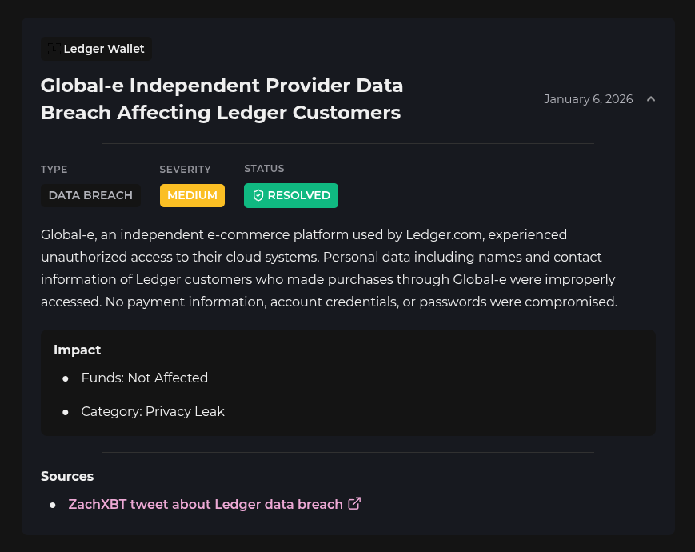
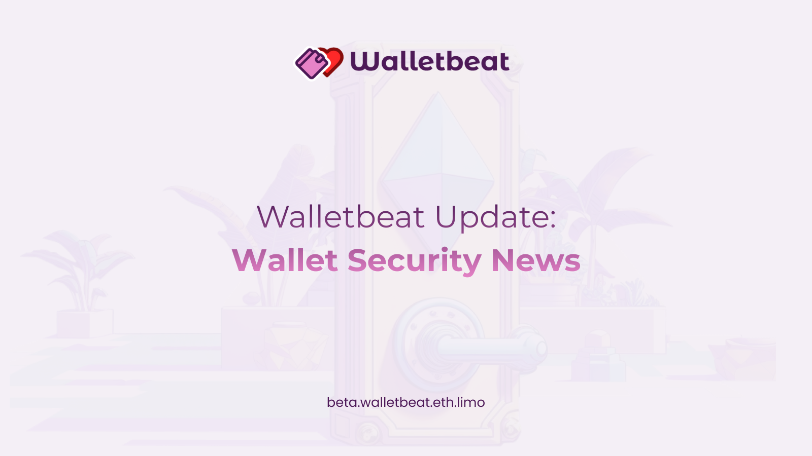

Tweet #1:

New on Walletbeat: Wallet Security News 🔐

A new way to surface important security-related events tied to wallets.

---

Tweet #2:

Security hacks are not new, and they shouldn't be ignored.

Walletbeat helps users stay informed about the latest wallet security news: hacks, vulnerabilities, data breaches, and other incidents.

---

Tweet #3:

What kind of news does Walletbeat track?

• Hacks — fund theft from exploits
• Data breaches — leaked user info
• Vulnerabilities — security flaws
• Incidents — other security events

---

Tweet #4:

Here's what that looks like in practice:

🔴 Trust Wallet v2.68 supply chain attack — $8.5M lost
🟡 Ledger customer data leaked via third-party provider

Real incidents users should know about.

---

Tweet #5:

See more (then the link)

