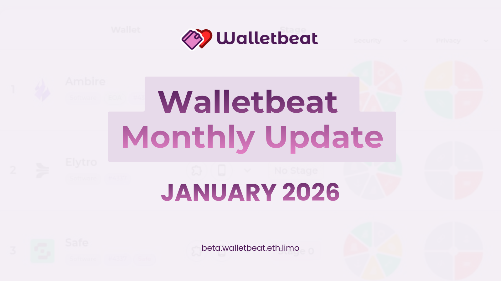

---
Tweet #1
Walletbeat January monthly update is here!

Check out what happened across Walletbeat and the wallet ecosystem 👇
---
Tweet #2
OKX Wallet has been added to Walletbeat.

OKX describes itself as “a universal crypto wallet available on multiple platforms.”
---
Tweet #3
Bitget Wallet is now live on Walletbeat as well.

Bitget describes itself as “a leading multi-chain decentralized wallet.”
---
Tweet #4
Zeus Wallet has also joined the Walletbeat ratings.

Zeus describes itself as a truly seedless, decentralized, self-custodial Ethereum wallet.

Special thanks to @mikemolfetas1 for the contribution!
---
Tweet #5
Elytro’s public audits have now been added to its Walletbeat profile, improving transparency in its rating.
---
Tweet #6
Two major updates for Ambire:

- Transaction legibility is now fully updated, completing the data needed for a full Walletbeat rating.
- Ambire shipped an update and now passes the Chain Configurability rating.
---
Tweet #7:
Message signing legibility is now a rated attribute!

Walletbeat evaluates whether wallets properly display EIP-712 data and transaction hashes.
---
Tweet #8:
Introducing Walletbeat News! Track wallet security incidents and updates.

Each wallet profile now includes relevant security news with a dedicated news page.
Tweet #9:
Enhanced transaction legibility with detailed breakdowns.

Now shows what data each wallet decodes and where decoding happens.
---
Tweet #10:
Improved responsive layout
Walletbeat now scales beautifully across all screen sizes.

Enhanced flex layouts and proportional font scaling ensure readability on any device.
---
Tweet #11:
Lists and tables have been redesigned across Walletbeat.

Unified styling brings better spacing and clearer visual hierarchy to all data displays.
---
Tweet #12:
We've introduced a custom component UI guide for consistent design patterns across Walletbeat.
---

Tweet #13:
Walletbeat now supports flexible provider configurations.

We can switch between Blumen, Omnipin, and Helios for improved reliability.
---
Tweet #14:
Upgraded to Omnipin v2 for ENS-related data.

This brings improved accuracy for Ethereum Name Service integrations.
---