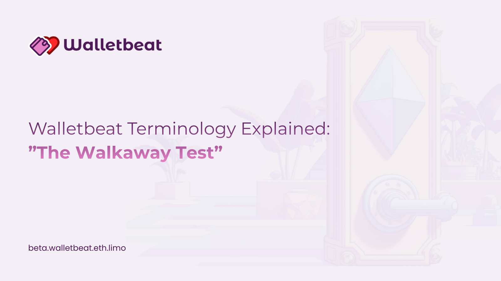

Tweet #1

**Walletbeat Terminology Explained:**

The Walkaway Test

-----

Tweet #2

"What is the Walkaway Test?"

Simply put, If the team stopped working on the wallet tomorrow, how long could it continue to function safely and independently?

-----

Tweet #3

The test looks at whether users are protected without relying on continuous team intervention.
No updates. No emergency servers. No manual overrides.

-----

Tweet #4

This surfaces hard questions:

– Are upgrades optional or forced?

– Are critical services centralized?

– Can users still sign, recover, and transact trustlessly?

-----

Tweet #5

Why it matters: wallets are long-lived infrastructure.
Users should not depend on a team’s availability, funding, or goodwill to retain control of their assets.

-----

Tweet #6

Wallets that pass it move closer to one of Ethereum's core values: **self-sovereignty**.

-----

